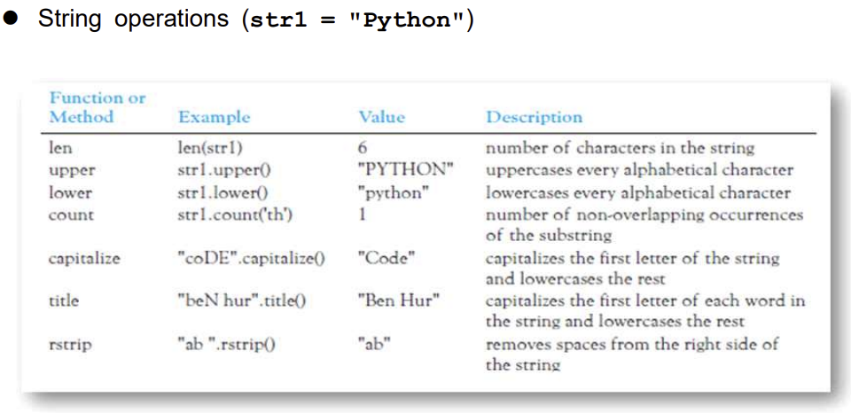
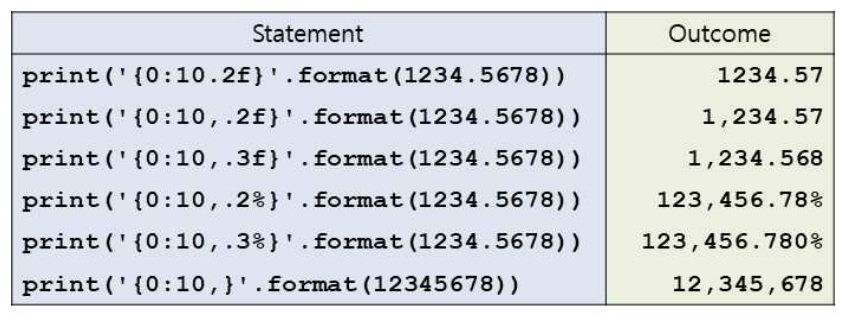

# 01. Basics of Python

> str.upper() 이런걸 메소드, len(str) 이런걸 함수라고함.

|Expression|Explaination|
|---|---|
|`type(값)`| str, float, tuple 와 같은 type을 알려줌 |
|`abs(값)`| 절댓값 |
|`int(값)`|소숫점이하 날림|
|`round(값,[몇째자리까지?])`|반올림|

```py
n=5 # 5를 저장하는 메모리부분을 변수 n이 참조한다.
n=7 # 버려진 5를 garbage collection 이 제거하게된다.
```

## String
- immutable 한번 정하면 바꿀 수 없다.

|Expression|Explaination|
|---|---|
|`eval(str수식)`|표현식을 정수또는 FP로 평가|
|`exec(str수식)`|<ins>python expression</ins>로 구성된 문자열 실행|
|`str(숫자)`|문자열로 바꿈|
|`ord(문자)`|아스키 숫자로 바꿈|
|`chr(숫자)`|아스키 문자로 바꿔줌|
            


```py
print('Python'[2:4])    # 2부터 4-1까지 출력
print('Python'.find('th'))  # 2 # 없으면 -1 출력
print('Python'.rfind('l'))  # rightmost l을 찾는다.
```

## Optional print Arguments
```py
print("hello","world",sep="*")  # hello*wolrd\n
print("hello",end="")   # hello

print('''{} was {}.
kk'''.format('name',20))

# < 왼쪽 맞춤 ^ 가운데 맞춤 > 오른쪽 맞춤
# default : 숫자는 왼쪽, 문자열을 오른쪽 맞춤
print("{0:^5}{1:<20}{2:>3}".format(1,"name anme",832))

print('{0:_^11}'.format('hello'))   # ___hello___

print('${0:,.2f}'.format(11163.75423))  # $11,163.75

```


