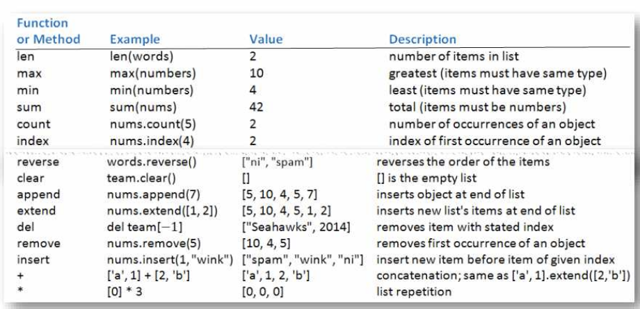

# 03. Data structures
## List []
- 순서 o , type이 모두 동일할 필요 x, 변경 가능한(mutable) data type



```py
nums = [1,2,3,3,4]
words = ['aaa','dfsa']

nums.count(3)   # 3
words.reverse() # reverse
nums.extend([1,2])  # [1,2,3,3,4,1,2]
nums.remove(4)  # [1,2,3,3,1,2]
del nums[1:3]   # [1,3,1,2]
words.insert(1,'wink')  # ['aaa','wink','dfsa']

['a',1]+[2,'b'] # ['a',1,2,'b']

[0]*3 # [0,0,0]

'a,b,c'.split(',')  # ['a','b','c'] 

' '.join(words) # aaa wink dfsa
```
- 문자열 split하면 list됨 
    - default는 whitespace(newline, tab, space)
- list를 join하면 string됨

> `list1.sort(key=len)` # 길이순으로 ascending sort

> `reverse = True` 이런 옵션을 뒤에 달아주면, descending sort
- 값.sort() 는 값을 바꾸고, sorted(값) 은 순서바꾼 새 복사본을 return 한다.
- 정렬 method는 list에만 사용할 수 있지만 sorted function은 list, string 및 tuple에도 사용 가능

## Tuple ()
- 순서 o , 변경 불가능한(immutable) data type

```py
t = ('a','b','c')
t = 'a','b','c' # 동일

(x,y,z) = ('a','b','c')
x,y,z = 'a','b','c' # 동일
```

### sequence
```py
list1 = ['aaa','bbb','ccc','ddd']
list1[::-1] # ['ddd','ccc','bbb','aaa']
list1[::-2] # ['ddd','bbb']
```

- list 함수는 tuple또는 string을 list로 바꾼다.
```py
list(('a','b')) # ['a','b']
list('python')  # ['p','y','t','h','o','n']
"python".split()    # ['python']   whitespace가 없음
```
### more about string
- strings are objects of the class str

```py
name = 'Swaroop'
if name.startswith('Swa'): print(true)   # Swa로 시작
if 'a' in name : print(true)    # 'a'가 들어있음
if name.find('war') != -1: print(true)  # war을 포함하고있음 없으면 -1를 리턴하니까.
```


## Set