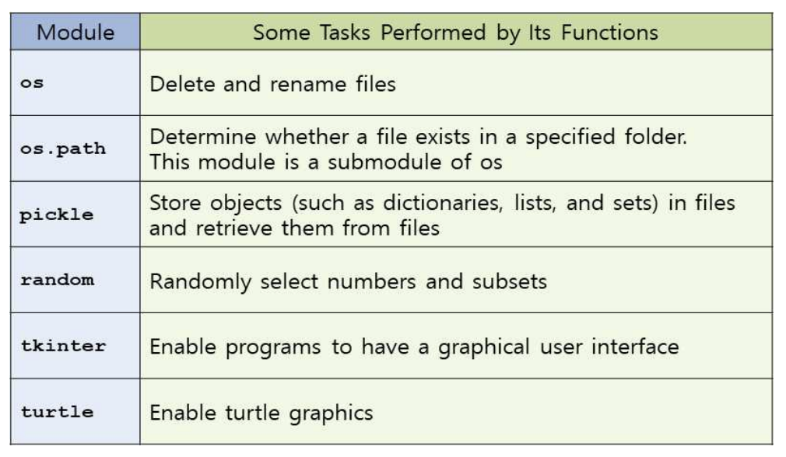

# 04. Functions
```py
def functionName(par1, par2, par3 = val3 , par4 = val4):
    #code
    return returnValue
```

- `return` == `return None` == ` `
- 키워드로 func(c=10,a=3) 이런식으로 호출하면 순서보다는 변수명에 맞게 들어감

## Scope of variable

### Local variable
- 함수 내부에서 만들어짐. 함수내부에서만 인식 가능. 
- 함수 호출될때마다 새로 만들어지고 사라짐
### Global variable
- 함수 밖에서 만들어짐. 프로그램 모든 곳에서 인식 가능.
- `global 변수명`를 쓰고 변수를 바꿔야 전역변수값이 바뀐다.
    - 이름이 동일시 로컬이 우선순위 (젤 최근에 만들어진 것)
    ```py
    x = 50

    def main():
        func()
        print(x)
    
    def func():
        global x    # 전역변수라고 표시를 해줘야함 !

        print(x)
        x=2
        print(x)    # 전역변수가 바뀜
    ```

### Named constant 
- 프로그램에서 여러번사용되는 특수 상수
- 맨 위에 `INTSERT_RATE = 0.04` 이런식으로 대문자와 `_`로 만들어짐

## Library Modules
- 확장자가 .py인 파일
    - import 즉, 사용할수있는 함수나 변수명을 담고있음
- IDLE나 text editor 에서도 만들어질 수 있다. 

```py
import 모듈명

모듈명.함수명   #모듈의 함수호출
모듈명.변수명   #모듈의 변수호출
```

### 모듈 import 방법
1. 특정함수만 import 
    - `from random import randint, choice`
2. 모든함수 import
    - 비추
3. interference없이 전체 모듈 import
    - `모듈명.`찍고 호출하면됨

- `as`로 별칭도 가능
    - `import numpy as np`
    - import 맨위에서 안해도 되긴함



## List Comprehension

- `list2 = [f(x) for x in list1]`
```py
list1 = ['2','5','8']
[int(x) for x in list1] # [2,5,8]

[g(x) for x in list1 if int(x) %2 == 1] # g(x) for x in list 실행 후, if문 돌려서 나옴
```

## Lambda Expression
- `lambda par1, par2,... : expression`
```py
names = ["aaa ccc","bbb bbb", "ccc aaa"]
names.sort(key=lambda name: name.split()[-1])
nameString = ", ".join(names)
print(nameString)   # ccc aaa, bbb bbb, aaa ccc
```