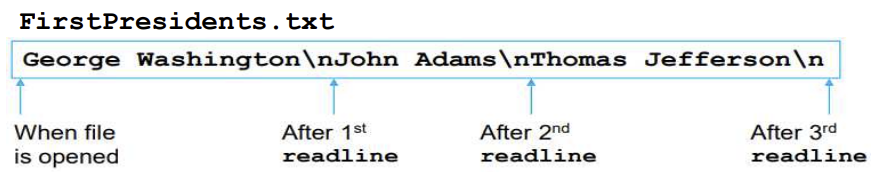

# 05 Data Processing And File Access

## txt files
- `strVar = infile.readline()` : 실행할때마다 pointer위치가 다음줄로 이동
    - 다읽으면 ""반환
    

- `outfile = open(filename,'w')` : 파일 없으면 생성 후 열기
- `outfile.writelines(list1)` : list1이 \n을 포함한 쓰고자하는 전체내용 list
    -  (writeline 이딴거 없음!!!!!!!!!!!!!!)
- `outfile.write(strVar)` : 문자열하나 입력. 한 줄 의미X
    - (한줄 입력하고싶으면 \n넣어서 알아서 입력하셈)


```py
import os.path  # 파일 삭제, 이름 변경, 파일 존재여부 확인을 위한 모듈

if os.path.isfile("ABC.txt"):
    print("file already exist.")
else:
    infile = open("ABC.txt",'w')
    infile.write("a\nb\nc\n")
    infile.close()
```

- `os.remove(filename)` : 파일 삭제 (열려있으면X)
- `os.rename(oldfilename,newfilename)` : 파일명 수정 (열려있으면X)
- `os.path.isfile(filename)` : 파일 존재 여부 확인

## csv files
- CSV(쉼표로 구분된 값) 형식
- 각 라인에 여러 데이터 항목이 들어있음

## 바이너리파일에 dictionary 저장하기
- `pickle` 모듈 import 해야함
    ```py
    import pickle

    outfile = open(filename,'wb')
    pickle.dump(dicname,outfile)
    outfile.close()

    infile = open(filename,'rb')
    dicname = pickle.load(infile)
    infile.close()
    ```
    - 바이너리파일에 대한 확장자는 `".dat"`이다.