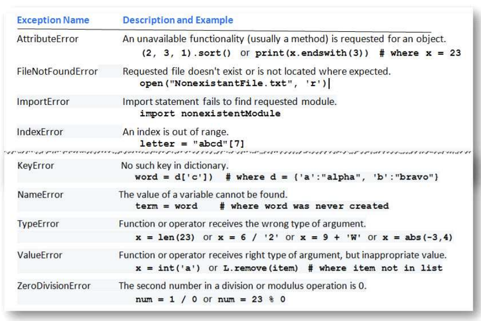

# 06 Miscellaneout Topics

## Exception Handling


```py
def main():
    total = 0
    count = 0
    foundFlag = 0
    try:
        infile = open("Numbers.txt","r")
    except FileNotFoundError:
        print("File X")
        foundFlag = False
    
    if foundFlag:
        try:                        # try
            for line in infile:
                count += 1
                total += float(line)
            print("avg:",total/count)
        except ValueError:          # exc1
            print("line",count,"could not be converted to a float")
            if count <1:
                print("avg so far",total/(count-1))
                print("total so far",total)
            else:
                print("no avg can be calcul")
        except ZeroDivisionError:   # exc2
            print("empty")
        else:                       # else
            print("total",total)
        finally:                    # finally : 무조건 실행 !!
            infile.close()
```

## selecting random value

```py
import random 

elements = ['a','b','c']
print(random.choice(elements))
print(random.sample(elements,2))    # 2개 list로 뽑기
random.shuffle(elements)
print(elements) # 섞임
print(random.randint(1,5))  # 1~5 값 랜덤 뽑기
```
```py
import pickle

infile = open(filename, 'rb')
decOfCards = pickle.load(infile)
infile.close()  # 이런식으로 뽑기 가능
```

## swapping

```py
x,y = y,x # 이렇게하면 swap 쉽게 가능
```

## shortcuts
```py
x,y,z = L # L = [1,2,3] 일때 쉽게 값 넣기 가능
```
## Recursion

```py
def power(r,n):
    if n==1:
        return r
    else:
        return r*power(r,n-1)

print(power(2,3))
```

```py
def isPalindrome(word):
    word = word.lower()
    if len(word) <=1:
        return True
    elif word[0] == word[-1]:
        word = word[1:-1]
        return isPalindrome(word)
    else:
        return False
```