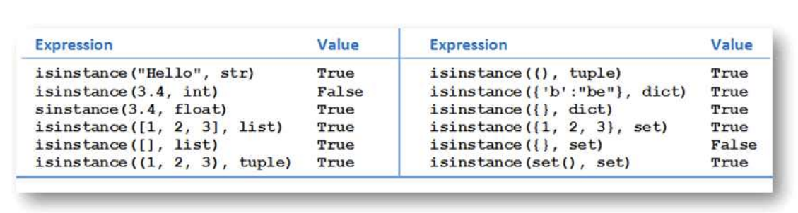

# 07 OOP (object-oriented programming)

## Classes and Objects
- class : 객체가 생성되는 templete
    - str, int, float, list, tuple, dictionary 는 built-in python classes
    - class의 각 instance(객체)에는 고유 값이 있다.
    ```py
    class className:
        #method
    ```
    - 메서드는 첫번째 매개변수로 self를 갖는다.
        - 객체가 생성되는 각 메서드의 self 매개변수는 객체를 참조
    - `__init__` method (생성자) 는 객체가 생성될 때 자동으로 호출되어 인스턴수 변수(클래스의 속성)에 값을 할당한다.
        ```py
        def __init__(self):
            self._width = 1
            self._height = 1

        def __init__(self, width, height):
            self._width = width
            self._height = height
            
        ```

    - `__str__` method : 객체의 상태(instance 변수값)을 문자열로 표현하는 사용자 지정 방식 제공 
        - 객체 생성시 실행되는 부분중 하나인듯

    - 객체 생성 방법?
        ```py
        objectName = ClassName(arg1,arg2,...)
        
        objectName = modulName.ClassName(arg1,arg2,...)
        ```


> 객체 변수 명은 `_`로 시작하므로 클래스 정의 외부에서 직접 엑세스할 수 없다. 
    - 객체 지향 프로그램이은 클래스 사용자에게 메서드 구현을 숨긴다.

## Inheritance 상속
- 이미 존재하는 class의 수정 class를 만들 수 있다.
- Super class, Parent class, Base class
- Sub class, child class, derived class
    - 얘가 inherits 상속받는다 superclass의 속성이나 메소드를.
        - 자기만의 property, method를 가질수 있다.  (overriding)
            - 자기만의 속성이 없으면 굳이.. 초기화 메소드를 만들 필요가 없다.


## is-a
> Each child satisfies the "is-a" relationship with the parents.

## isinstance
- `isinstance(object,className)`
    - object가 해당 class 또는 subclass의 객체이면 return True
    
    - `{}`하면 dict가 나옴. 
        - set을 원하면 `set()`을 해야 빈 set이 나옴

## add new instance variables to a subclass
```py
def __init__(self, name="",mid=0,final=0,fullTime=True):    # 기존에 호출하는거 싹다 불러주고, 원하는 매개변수까지 추가
        super().__init__(name,mid,final)     # 이거 먼저 호출해줘야함
        self._fullTime = fullTime   # 이후 원하는 instance 추가
```

## Polymorphism 다형성
- 모든 객체지향 프로그래밍 언어 특징
- 두클래스가 동일한 메소드 이름을 사용하지만 구현이 다른걸 허용

## Multiple Inheritance 다중상속
- 한 클래스가 두개를 동시에 상속받음
    - 모든 기본 클래스의 기능은 파생 클래스에 상속됨
```py
class Base1:
    pass
class Base2:
    pass
class MultiDerived(Base1, Base2):   #다중 상속
    pass
```

- MRO (Method Resolution Order)
    - 지정된 속성은 현재 클래스에서 먼저 검색된다.
    - 찾을 수 없는 경우, 동일한 클래스를 두번 검색하지않고 깊이 우선으로 왼쪽->오른쪽 방식으로 상위클래스로 검색을 계속함